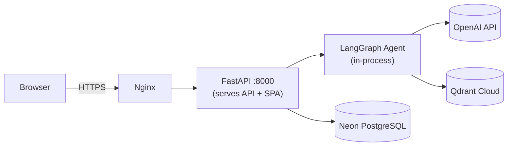
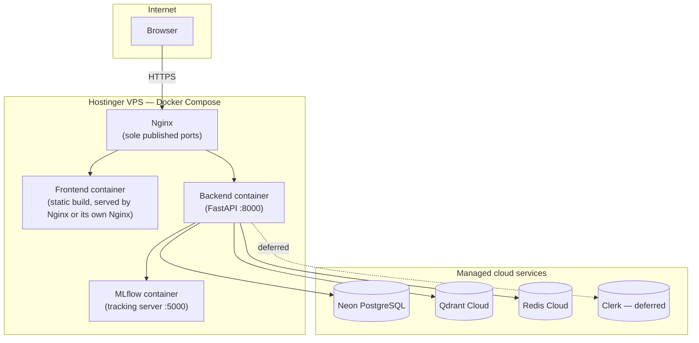
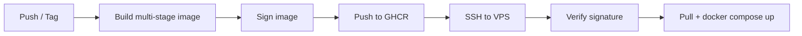
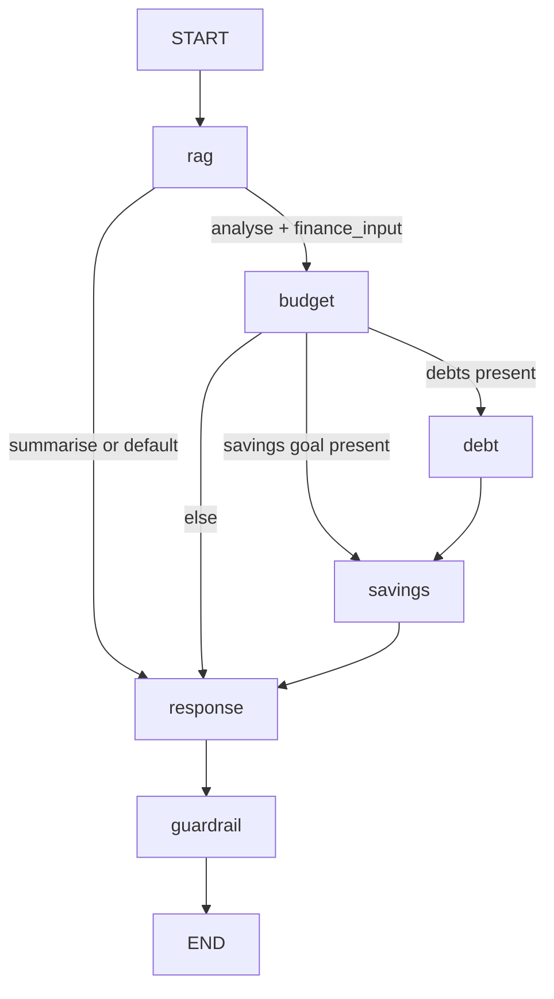

# FinEval HLD — Architecture

Read this when touching deployment, Docker Compose, Nginx, CI/CD, the FastAPI domain
structure, or the API surface as a whole.

This document has two parts: **Current Architecture** (brief — CONTEXT.md is the source
of truth for what exists today) and **Proposed Architecture** (the target this project is
migrating toward). Do not build against Proposed until a migration step explicitly says to.

---

## 1. Overview

FinEval is an agentic AI personal finance assistant paired with a production-grade
evaluation framework, built to demonstrate Senior AI QA Engineer and MLOps skills. It is
not a real financial product — see `DisclaimerBar.tsx` and the guardrail node.

---

## 2. Current Architecture (summary — see CONTEXT.md for full detail)

- **Single container, production.** FastAPI serves both the API and the built React SPA
  (`frontend/dist` copied into the Python image at build time).
- **No service layer.** Routers (`chat.py`, `analyse.py`, `documents.py`) call the
  LangGraph agent directly.
- **No domain separation.** All Pydantic schemas live in one file
  (`backend/app/models/schemas.py`).
- **Cloud-hosted data tier already:** Neon PostgreSQL (serverless) and Qdrant Cloud. Redis
  is declared but not wired.
- **Observability: not yet integrated.** MLflow Tracking is planned (Sprint 1.6/3.1);
  there is no per-request tracing yet.



---

## 3. Proposed Architecture

### 3.1 Backend domain restructuring

Replace the flat router structure with a domain-driven pattern. The LangGraph agent
(`agent/`) and RAG pipeline (`rag/`) are **untouched** — they become a black box the
service layer calls into, not something restructured themselves.

```
backend/app/
├── main.py
├── config.py
├── database.py          moved from models/database.py
├── exceptions.py         domain exceptions, all subclass ValueError
├── deps.py               get_db, get_agent
├── agent/                UNTOUCHED
├── rag/                  UNTOUCHED (except wait=True fix)
├── chat/
│   ├── router.py         POST /chat  — HTTP only
│   ├── service.py         orchestrates agent call + session persistence
│   ├── repo.py            ChatSession CRUD
│   └── schemas.py         ChatRequest, ChatResponse
├── analyse/
│   ├── router.py, service.py, repo.py (future), schemas.py
├── documents/
│   ├── router.py, service.py, repo.py, schemas.py
└── health/
    ├── router.py          GET /healthz, GET /healthz/ready
    └── schemas.py
```

**Layering rule (see `fineval-architecture-guard`):** `router.py` validates the request,
calls `service.py`, commits, returns. `service.py` orchestrates and raises domain
exceptions. `repo.py` is DB access only. `session.commit()` lives only in routers.

**Domain exceptions** (`exceptions.py`): `AgentInvocationError` (500),
`DocumentIngestError` (422), `UnsupportedFileTypeError` (415), `SessionNotFoundError`
(404), `RAGRetrievalError` (500), `GuardrailTriggeredError` (422).

### 3.2 Deployment topology — separate containers

Frontend and backend become **two separate containers** (replacing the current
single-container-serves-SPA design). Database (Neon) and cache (Redis) are cloud-hosted
managed services — not containers in the compose file. MLflow's tracking server **is** a
container — see §6.



### 3.3 Authentication — deferred

Clerk (auth-as-a-service) is the planned integration to avoid building session/token
management in-house. **Not part of this build cycle** — see `fineval-security` and
`fineval-session` skills. When it lands: `ProtectedRoute` on the frontend gains a real
guard (currently scaffolded as a no-op redirect), and `deps.py` gains a `get_current_user`
dependency backed by Clerk's session verification. Redis's role (§ Data HLD) does **not**
change when this lands — Clerk owns the full token lifecycle independently; Redis stays
scoped to conversation caching only.

### 3.4 CI/CD

- **Separate workflow per test discipline** — `test-functional.yml`, `test-performance.yml`,
  `test-load.yml`, `test-eval.yml` — instead of one sequential `test-suite.yml`. Each
  publishes its own report; each still runs with `continue-on-error: true` at the
  test-runner-step level (see Test Framework HLD). `ci_gate.py` remains the only step
  across all of them permitted to fail the pipeline.
- **Build-and-deploy script gains tag support.** A release is a tag (`v1.0.0`), not just
  `latest` on `main` — enables rollback to a known-good image by tag rather than by commit
  SHA archaeology.
- **Image signing before deployment.** Built images are signed (e.g. cosign/sigstore)
  before push to GHCR; the deploy step verifies the signature before pulling on the VPS.
  This guards against a compromised registry or MITM on the pull step — pin-versions
  discipline (`fineval-ci`) protects the build inputs, signing protects the build output.



---

## 4. LangGraph Agent Architecture

Unchanged by the proposed restructuring — this is the "black box" the new service layer
calls into.

**State:** `FinanceAgentState` (`TypedDict`, `Annotated` fields where a reducer is
needed — see `fineval-architecture-guard`).

**Topology:**



**Nodes:** `rag_node` (retrieval), `budget_node` / `debt_node` / `savings_node` (tool
invocations), `response_node` (LLM call, per-flow_type prompt), `guardrail_node`
(sanitisation — see `fineval-agentic-design` and `fineval-agent-testing`).

**Tools:** `budget_analyser` (50/30/20 rule), `debt_calculator` (avalanche + snowball),
`savings_projector` (compound interest FV).

**`PROMPT_VERSION`** (currently `v3`) — bump protocol in `fineval-architecture-guard`.

---

## 5. API Surface

| Method | Path | Purpose |
|---|---|---|
| `POST` | `/chat` | Conversational Q&A, `flow_type="chat"` |
| `POST` | `/analyse` | Budget/debt/savings analysis, `flow_type="analyse"` |
| `POST` | `/documents/upload` | Ingest a document into Qdrant |
| `GET` | `/healthz` | Liveness |
| `GET` | `/healthz/ready` | Readiness (Neon + Qdrant reachability) |

Full request/response contracts live in `FINEVAL-HLD-DATA.md` (schema shapes are a data
concern) and `FINEVAL-HLD-CLIENT-USECASES.md` (consumption pattern from the frontend).

---

## 6. Observability

**No Langfuse.** MLflow covers both roles:

- **MLflow Tracking** — aggregate eval-run metrics over time, read by `ci_gate.py`.
- **MLflow Tracing** — per-request instrumentation (the role Langfuse would have played),
  giving a `trace_url` for a single `/chat` or `/analyse` call.

Both features share one deployed tracking-server container (§3.2). Full setup — backend
store choice, autologging, `mlflow.trace` instrumentation pattern, trace URL surfacing —
is in `FINEVAL-HLD-EVAL-FRAMEWORK.md` §7, since it's fundamentally an eval-framework
concern that happens to also serve production observability.

---

## 7. Current Status & Gaps

See CONTEXT.md's sprint plan — not restated here to avoid two sources of truth on
build status. This document describes target state; CONTEXT.md tracks progress against it.

---

## 8. Key Design Decisions

- **Mock-first, then real** — backend started with mock endpoints before wiring the
  LangGraph agent, so the eval suite could establish a baseline against deterministic
  responses.
- **Agent as black box** — the domain restructuring (§3.1) explicitly does not touch
  `agent/` or `rag/`. This keeps the service layer independently testable without
  destabilising the tested agent logic.
- **MLflow over Langfuse+MLflow** — one deployed service instead of one service + one
  external SaaS dependency, at the cost of using MLflow's newer, less battle-tested
  Tracing feature for the per-request role.
- **Qdrant chunk size (512 tokens) is a versioned contract** — see `FINEVAL-HLD-DATA.md`
  and `FINEVAL-HLD-EVAL-FRAMEWORK.md`.
