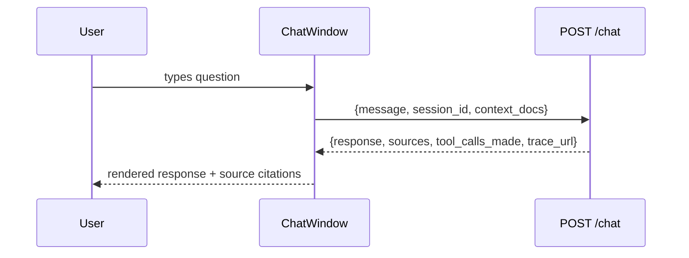
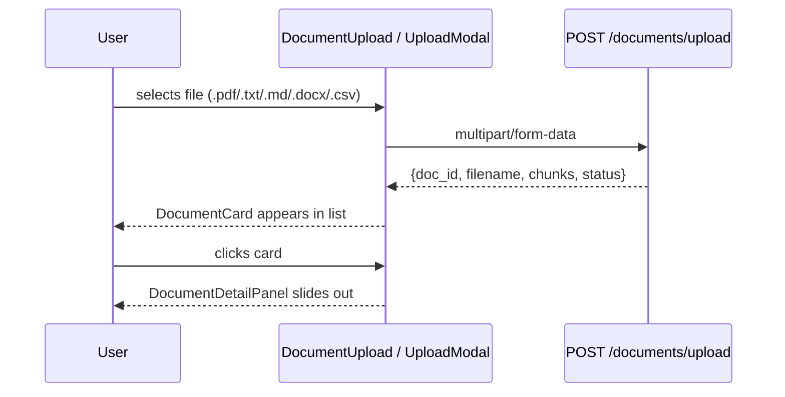

# FinEval HLD — Client Use Cases

Read this when working on frontend routing, page flows, or user-facing behaviour.

---

## 1. Overview

FinEval's frontend is a React 18 + TypeScript SPA. It is functionally complete (21
components, 6 pages) as of this document's writing — this doc describes what exists and
how it's used, not a build plan.

---

## 2. Page & Component Inventory

| Page | Purpose | Key components |
|---|---|---|
| `Dashboard.tsx` | Landing page, charts + summary | `SpendVsIncomeChart`, `CategoryDonut`, `BudgetHealthCards`, `TopSpendingCategories` |
| `Chat.tsx` | Conversational Q&A | `ChatWindow` |
| `Analyse.tsx` | Budget/debt/savings analysis | `BudgetForm` |
| `Documents.tsx` | Upload + manage documents | `DocumentUpload`, `DocumentCard`, `DocumentDetailPanel`, `UploadModal` |
| `PersonalData.tsx` | Personal finance data entry | — |
| `Reports.tsx` | **Stub — no real content yet** | — |

**Cross-cutting components:** `NavBar`, `MobileBottomNav`, `MobileChatSheet`,
`FloatingChat`, `ChatPanel`, `HistorySidebar`, `StatusBar`, `DisclaimerBar`.

**Contexts:** `ChatContext`, `SidebarContext`, `ThemeContext` — UI-only state, not
cross-page data (see §4).

---

## 3. Primary Use Cases

### 3.1 Ask a finance question

Entry points: `Chat.tsx` (full page), `FloatingChat`/`ChatPanel` (persistent access from
any page), `MobileChatSheet` (mobile equivalent).

### 3.2 Analyse a budget

`Analyse.tsx` wraps `BudgetForm`, which collects income/needs/wants/debts/savings-goal and
posts to `POST /analyse`. Response populates `BudgetHealthCards`, and — if debts/savings
inputs were present — debt payoff and savings projection results.

### 3.3 Upload and process a document

### 3.4 View dashboard / reports

`Dashboard.tsx` is complete and chart-driven. `Reports.tsx` is a **known stub** — see §6.

---

## 4. State Management

- **Cross-page / API-derived state:** currently held in React contexts
  (`ChatContext` for message history within a session). No Redux yet — see the parked
  architecture session for a proposed Redux Toolkit layer, not yet built.
- **UI-only state:** `useState` locally in components (modal open/close, form step) —
  unaffected by any future Redux addition.
- **API client (`api/client.ts`):** typed Axios wrapper. `ChatResponse` and
  `AnalyseResponse` interfaces already expect a `trace_url: string | null` field — this is
  populated once MLflow Tracing is wired (§ Architecture HLD 6), `null` until then.

---

## 5. Mobile / Responsive

`MobileBottomNav` and `MobileChatSheet` are dedicated mobile components, not just
responsive breakpoints of the desktop versions — chat in particular gets a different
interaction pattern (bottom sheet vs. persistent panel) below the mobile breakpoint.

---

## 6. Known Gaps

- **`Reports.tsx` is a stub** (20 lines, no real content) — not scheduled to a specific
  sprint in CONTEXT.md as of this writing.
- **No auth.** All routes are currently public. When Clerk lands (§ Architecture HLD 3.3),
  a `ProtectedRoute` guard is the planned mechanism — scaffolded as a no-op redirect until
  then, per `fineval-session`.
- **`trace_url` is always `null`** until MLflow Tracing is wired — the frontend contract
  already expects the field, so no frontend change is needed when it activates.
