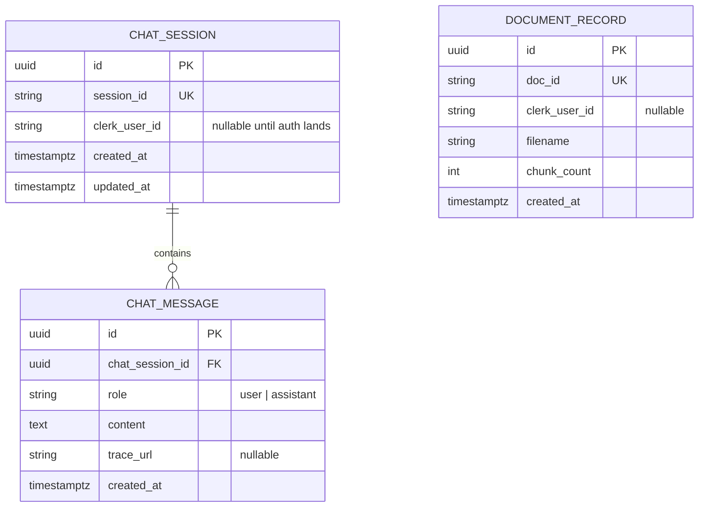
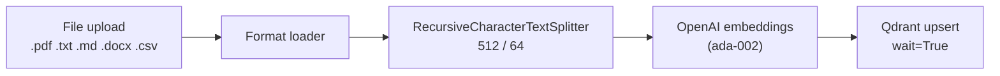
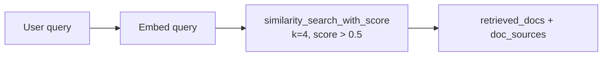
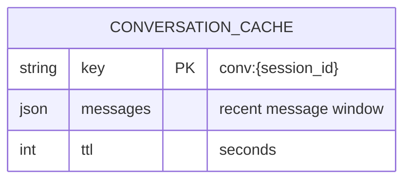
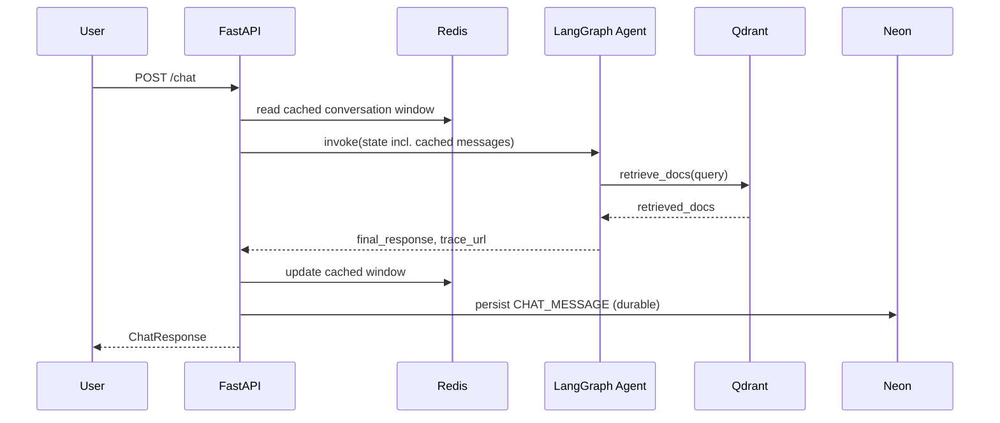

# FinEval HLD — Data

Read this when changing schema, Neon models, Qdrant collection design, or Redis key
structure. Three stores, three different jobs — this document is organised by store, not
by feature.

---

## 1. Overview

| Store | Job | Hosting |
|---|---|---|
| Neon PostgreSQL | Durable relational data (chat history, future document records) | Cloud (serverless) |
| Qdrant | Vector search over finance documents (RAG) | Cloud |
| Redis | Short-term LangGraph conversation-state cache | Cloud |

All three are cloud-hosted managed services in the proposed architecture — none run as a
local container (see `FINEVAL-HLD-ARCHITECTURE.md` §3.2).

---

## 2. Neon PostgreSQL

### Current state

No ORM models exist. `init_db()` runs `Base.metadata.create_all` at startup — additive
only, no Alembic. See `fineval-migrations`.

### Proposed schema

**No local `User` table.** Auth is deferred to Clerk (§ Architecture HLD 3.3); when it
lands, Clerk owns the user store. FinEval's own tables reference a `clerk_user_id` string,
not a foreign key into a table FinEval doesn't own.

`CHAT_MESSAGE` as a separate table (rather than a JSON blob on `CHAT_SESSION`, as an
earlier sprint note suggested) is proposed here because it makes per-message `trace_url`
storage straightforward — a JSON blob would need to embed trace URLs per message anyway,
at which point a real table is simpler to query. `DOCUMENT_RECORD` tracks what's been
ingested into Qdrant per user/session — proposed, not yet scheduled to a sprint.

All timestamps UTC — see `fineval-code-quality` / architecture-guard conventions.

### Migration strategy

`create_all` is sufficient until the first schema change against deployed data. See
`fineval-migrations` for the trigger point and Alembic introduction discipline.

---

## 3. Qdrant

### Collection config

| Setting | Value |
|---|---|
| Collection name | `finance_docs` (env-overridable) |
| Vector size | 1536 (matches `text-embedding-ada-002`) |
| Distance | Cosine |
| Chunk size | **512 tokens — locked, versioned contract** |
| Chunk overlap | 64 tokens |
| Similarity threshold | 0.5 |
| Top-K | 4 |

The chunk-size contract: changing it requires re-running `test_rag_quality.py` and a new
entry in `FINEVAL-HLD-EVAL-FRAMEWORK.md`'s decision log. See `fineval-rag-observability`.

### Ingestion pipeline

`wait=True` on every user-initiated write — see `fineval-destructive-operations`. A
fire-and-forget write can silently drop a chunk if the process restarts before Qdrant
confirms it.

### Retrieval

---

## 4. Redis

### Current state

Declared in config, not wired.

### Proposed role — LangGraph conversation caching

Redis holds a **short-term cache of in-flight conversation state**, complementing (not
replacing) Neon's durable `CHAT_SESSION`/`CHAT_MESSAGE` persistence. The pattern: a
conversation's recent `messages` window is cached in Redis for fast read during an active
session; Neon is the durable write target once a turn completes.

**Not used for:** auth tokens, refresh tokens, or session-login state — those belong to
Clerk once auth lands (§ Architecture HLD 3.3). Redis stays auth-agnostic.

### Key patterns

| Prefix | Example | TTL | Purpose |
|---|---|---|---|
| `conv:` | `conv:sess_abc123` | Sliding, refreshed on activity | Cached recent message window for an active conversation |

This table is intentionally minimal — it reflects only what's proposed today. Prompt
caching was considered and explicitly dropped in favour of this narrower scope (per
project decision).

---

## 5. Data Flow — End to End

---

## 6. PII & Synthetic Data

Synthetic test fixtures are a data-design concern that lives fully in
`FINEVAL-HLD-EVAL-FRAMEWORK.md` §6 — cross-referenced here, not duplicated. The one rule
worth restating: no real names, account numbers, phone numbers, or PAN in any stored data,
test fixture, or log line, ever.

---

## 7. Environment Variables (data-related)

| Variable | Purpose |
|---|---|
| `DATABASE_URL` | Neon connection string |
| `QDRANT_URL`, `QDRANT_API_KEY`, `QDRANT_COLLECTION` | Qdrant Cloud |
| `REDIS_URL` | Redis Cloud connection |

See `.env.example` for the full list including non-data variables.
